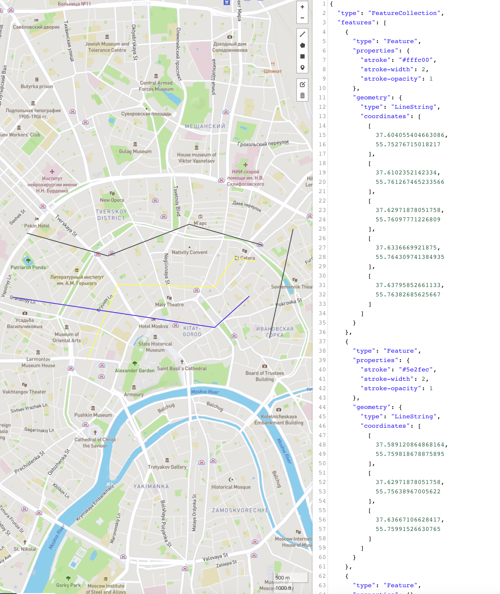

# Intersects of LineStrings

Демо-проект на Spring Boot для проверки пересечения линий на карте.

[Пример geojson](/wiki_resources/lines.geojson).

Два эндпоинта:

POST добавляет в базу линии, переданные в дате, при этом линиям, пересекающимся с 
другими линиями в этом наборе данных, присваивается "цвет" красный, остальным - синим.

GET извлекает линии определённого цвета в зависимости от state (по умолчанию false), 
где true - красный, false - синий.

curl -X POST -H "Content-Type: application/json" -d /geojson/ http://localhost:8080/intersections

curl http://localhost:8080/intersections?state=/state/

Визуализация geojson:
